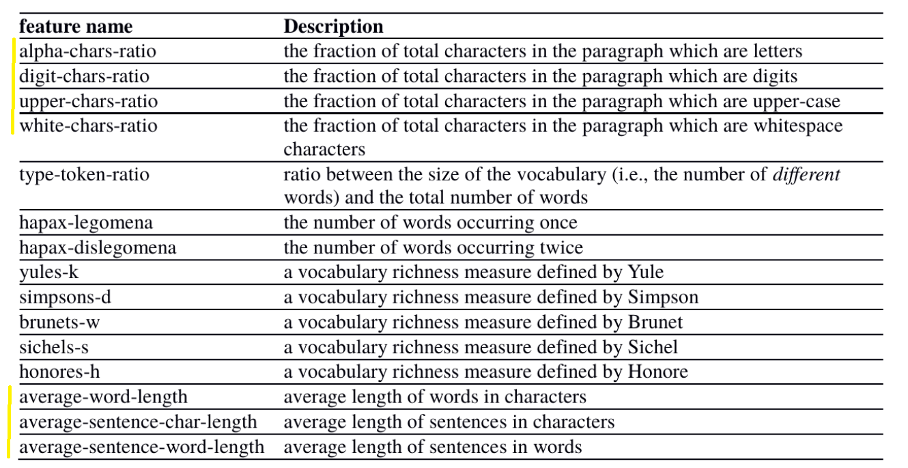

# Author Attribution

a.k.a. *authorship attribution* or *author identification*.

## Problem Setting

## Related Work
### Papers
- https://web.stanford.edu/class/archive/cs/cs224n/cs224n.1174/reports/2760185.pdf
- https://www.aclweb.org/anthology/C18-1029.pdf
  
    - > We find that the most effective features for datasets can be predicted by applying topic modeling and feature analysis. Content-based features tend to be suitable for datasets with high topical diversity such as the one constructed from on-line news. Datasets with less topical variance, e.g. legal judgments and movie reviews, benefit more from style- based features.

### Useful links
- https://towardsdatascience.com/a-machine-learning-approach-to-author-identification-of-horror-novels-from-text-snippets-3f1ef5dba634
- https://machinelearningmastery.com/sequence-classification-lstm-recurrent-neural-networks-python-keras/
- https://www.kaggle.com/christopher22/stylometry-identify-authors-by-sentence-structure

## Features

### Post Specific (Lukas)

* CreatedAt time
* Number of Pos/Neg votes 
* Exist Parent Post
  * is always just responding or does create own posts
* Parent Post User
  * always responds to same user
  * parent votes pos/neg (maybe root post)
* Named Entities from Articles/Posts (Lukas)

### Stylometric (Patrick)

* Same features for title
* Total length of post/title

## Techniques

## Evaluation

### Results

### Interpretation